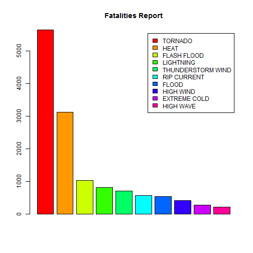
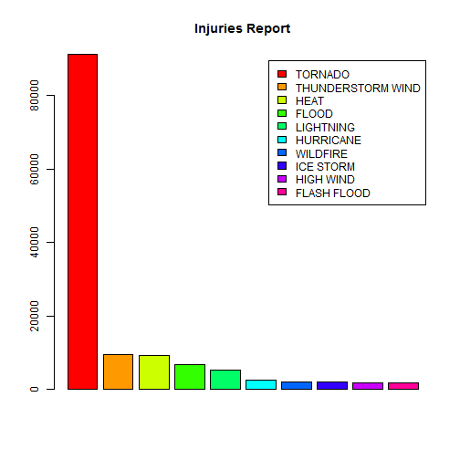
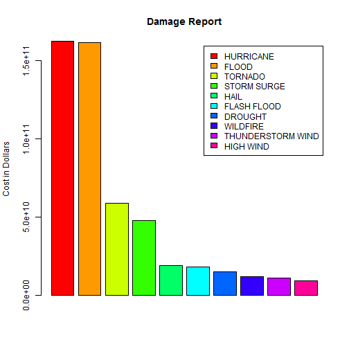

Casualties and Economic Impacts of Diaster Events from 1950 to 2011
==================================================================
Author: Vinh N. Pham
<hr/>

## Synopsis
Disaster events(storms, tornados, flood, ...) can have significant effects on
lives and economy.  In this report, we use the data originated from the U.S.
National Oceanic and Atmospheric Administration (NOAA) to explore this problem.

## Data Processing
### Data source loading


```r
ReadData <- function() {
   dataSource <- "https://d396qusza40orc.cloudfront.net/repdata%2Fdata%2FStormData.csv.bz2"
   dataZip <- "StormData.csv.bz2"

   if (!file.exists(dataZip)) {
      download.file(dataSource, dataZip)
   }

   read.csv(dataZip, header=TRUE, strip.white = TRUE, na.strings = c("NA","","?"))
}

rawData <- ReadData()
```
This is a big data source which contains 902297 rows and 37 columns.
Out of these columns, only 7 that are of our interests: EVTYPE, FATALITIES, INJURIES,
PROPDMG, PROPDMGEXP, CROPDMG, CROPDMGEXP.  Unfortunately, we still have to deal
with all the rows.

### Data Pre-Processing Summary
The most time consuming task in this project is actually pre-processing the data
to obtain the clean data for analysis.  The raw data available from NOAA contains
many conflicting encodings and mispellings that makes obtaining the clean data a
challenging task.  For example, sometimes the character "/", sometimes "-", is
used to separate the types of events within one records.  Sometimes character "-"
does not act as a separation.  Mispellings and short hand codes are pervasive.
For example all "FLO", "FLOO", "FLD", "FLDG" ... actually mean the same as "FLOOD".  Should
"BITTER COLD" and "EXTREME COLD" mean the same thing?  Even though I did a fairly
thorough renormalizing task, different grouping methods will result in slightly
different results.

### Data Pre-Processing Step-by-Step
#### Combine the damages (property and crop) into one 


```r
Exp2Numeric <- function(x) {
   if (is.na(x)) 0
   else if (x %in% c(0:9)) as.numeric(x)
   else if (x == 'H' | x == 'h') 10^2
   else if (x == 'K' | x == 'k') 10^3
   else if (x == 'M' | x == 'm') 10^6
   else if (x == 'B' | x == 'b') 10^9
   else 0
}

ComputeDamage <- function(data) {
      mapply(FUN=function(x,y) {x*Exp2Numeric(y)}, data$PROPDMG, data$PROPDMGEXP) +
      mapply(FUN=function(x,y) {x*Exp2Numeric(y)}, data$CROPDMG, data$CROPDMGEXP)
}


rawData$DAMAGE <- ComputeDamage(rawData)
rawData$EVTYPE[is.na(rawData$EVTYPE)] <- "OTHER"   # adjust one case
```

#### Initial remap of event types
The task of renormalization of event types are divided into 2 sub-tasks.  In
the first phase here, we try to correct various pervasive conflicting encodings,
and change all plurals to singulars.  It does not make sense to have "TORNADO",
"TORNADOS", or even "TORNADOES" as 3 separated categories.


```r
InitialRemap <- function(x) {
   require(stringr)   
   result <- toupper(str_trim(x))   # make it all capital
   
   result <- gsub('&',replacement="/", result)   # substitute '/' for '&'   
   result <-  gsub('\\\\', replacement="/", result)   # substitute '/' for '\'
   result <- gsub('\\sAND\\s',replacement="/", result) # substitute '/' for 'AND'
   result <- gsub(';',replacement="/", result)   # replace '/' for ';'
   result <- gsub('\\s*\\/\\s*',replacement="/", result)   # remove space on either sides of '/'
   
   result <- gsub('\\s*-\\s*',replacement="-", result)   # remove space on either sides of '-'
   ## remove all character '-' that doesn't separate terms so that the only character
   ## that separate terms are '/'
   result <- gsub('BLOW-OUT',replacement="BLOWOUT", result)
   result <- gsub('HURRICANE-GENERATED',replacement="HURRICANE", result)
   result <- gsub('LAKE-EFFECT',replacement="LAKE EFFECT", result)
   result <- gsub('LATE-SEASON',replacement="LATE SEASON", result)
   result <- gsub('NON-',replacement="NON", result)
   result <- gsub('LATE-SEASON',replacement="LATE SEASON", result)
   result <- gsub('-',replacement="/", result)
   
   result <- gsub('\\s+{2}',replacement=" ", result)   # remove redundant space
   result <- gsub('[()]',replacement="", result)

   result <- sub('\\W+$',replacement="", result)   # remove all non-word at the end
                  
   
   result <- gsub('\\bSNOWFALL\\b', replacement="SNOW", result)
   result <- gsub('\\bRAINFALL\\b', replacement="RAIN", result)
   result <- gsub('\\bASHFALL\\b', replacement="ASH", result)
   result <- gsub('\\bFLOODING\\b', replacement="FLOOD", result)
   
   result <- gsub('\\bTEMPERATURES\\b', replacement="TEMPERATURE", result)
   result <- gsub('\\bTIDES\\b', replacement="TIDE", result)
   result <- gsub('\\bFIRES\\b', replacement="FIRE", result)
   result <- gsub('\\bFUNNELS\\b', replacement="FUNNEL", result)
   result <- gsub('\\bCONDITIONS\\b', replacement="CONDITION", result)
   result <- gsub('\\bWINDSS\\b', replacement="WIND", result)
   result <- gsub('\\bWINDS\\b', replacement="WIND", result)
   result <- gsub('\\bCHILLS\\b', replacement="CHILL", result)
   result <- gsub('\\bJAMS\\b', replacement="JAM", result)
   result <- gsub('\\bFLOODS\\b', replacement="FLOOD", result)
   result <- gsub('\\bCLOUDS\\b', replacement="CLOUD", result)
   result <- gsub('\\bSTORMS\\b', replacement="STORM", result)
   result <- gsub('\\b\\bSEAS\\b', replacement="SEA", result)
   result <- gsub('\\bSHOWERS\\b', replacement="SHOWER", result)
   result <- gsub('\\bTREES\\b', replacement="TREE", result)
   result <- gsub('\\bSQUALLS\\b', replacement="SQUALL", result)
   result <- gsub('\\bTORNADOS\\b', replacement="TORNADO", result)
   result <- gsub('\\bTORNADOES\\b', replacement="TORNADO", result)
   result <- gsub('\\bWATERSPOUTS\\b', replacement="WATERSPOUT", result)
   result <- gsub('\\bPELLETS\\b', replacement="PELLET", result)
   result <- gsub('\\bLIGHTS\\b', replacement="LIGHT", result)
   result <- gsub('\\bEFFECTS\\b', replacement="EFFECT", result)
   result <- gsub('\\bSLIDES\\b', replacement="SLIDE", result)
   result <- gsub('\\bROADS\\b', replacement="ROAD", result)
   result <- gsub('\\bWAVES\\b', replacement="WAVE", result)
   result <- gsub('\\bFLURRIES\\b', replacement="FLURRY", result)
   result <- gsub('\\bSWELLS\\b', replacement="SWELL", result)
   result <- gsub('\\bGUSTS\\b', replacement="GUST", result)
   result <- gsub('\\bCURRENTS\\b', replacement="CURRENT", result)
   result <- gsub('\\bTEMPS\\b', replacement="TEMPERATURE", result)
   result <- gsub('\\bRAINS\\b', replacement="RAIN", result)
   result <- gsub('\\bSNOWS\\b', replacement="SNOW", result)
   result <- gsub('\\bADVISORIES\\b', replacement="ADVISORY", result)
   result <- gsub('\\bLANDSLIDES\\b', replacement="LANDSLIDE", result)
   result <- gsub('\\bTHUNDERSTORMS\\b', replacement="THUNDERSTORM", result)
   result <- gsub('\\bMUDSLIDES\\b', replacement="MUDSLIDE", result)
   result <- gsub('\\bHAILSTORMS\\b', replacement="HAILSTORM", result)
   result <- gsub('\\bWILDFIRES\\b', replacement="WILDFIRE", result)
   result <- gsub('\\bTHUNDERSTORMWINDS\\b', replacement="THUNDERSTORM WIND", result)
   
   result <- gsub('^SUMMARY.*', replacement="OTHER", result)
   result <- gsub('^NONE$', replacement="OTHER", result)
   
   result <- gsub('\\bWINS\\b', replacement="WIND", result)
   result <- gsub('W INDS', replacement="WIND", result)
   result <- gsub('\\bWND\\b', replacement="WIND", result)
   result <- gsub('\\bWINTRY\\b', replacement="WINTER", result)
   result <- gsub('\\bWINTERY\\b', replacement="WINTER", result)
   
}


rawData$TYPE <- sapply(levels(rawData$EVTYPE)[rawData$EVTYPE],InitialRemap)
```

```
## Loading required package: stringr
```

#### Create clean data with each row only contain one event type.
In the original raw data, each row represent more than one event types.  However,
instead of having "FLOOD/HEAVY RAIN" and "HEAVY RAIN/FLOOD" as unrelated categories,
we need to separate them out as "FLOOD" and "HEAVY RAIN".  This would mean double
counting the total damages.  Our purpose is to count the damages associated with
each event so double counting is expected in these specific cases, which
consist of around 11600 rows (approximately 1.2% of the total database).


```r
SeparateEventType <- function(data) {   
   evtype <- data$TYPE

   require(reshape2)
   evtype <- colsplit(evtype,"/",c("TYPE1","TYPE2","TYPE3"))
   evtype$TYPE2[evtype$TYPE2==""] <- NA
   evtype$TYPE3[evtype$TYPE3==""] <- NA

   data2 <- data[,c("REFNUM", "BGN_DATE", "FATALITIES","INJURIES", "DAMAGE")]
   data2 <- cbind(data2, evtype)

   data2 <- melt(data2, measure.vars=c("TYPE1", "TYPE2", "TYPE3"),
                 value.name="TYPE",
                 na.rm=TRUE)
   data2$variable <- NULL
   row.names(data2) <- NULL
   
   data2   # return new clean data
}

cleanData <- SeparateEventType(rawData)
```

```
## Loading required package: reshape2
```

The resulting clean data have 6 column.  4 columns that are of our interest(FATALITIES,
INJURIES, DAMAGE, TYPE).   The remaining 2 columns are used to identify the record
in case we want to trace back to original raw data (REFNUM), or to further analyzing the disaster
events (BGN_DATE) in the time dimension (which we do not analyze in this report)

#### Create a list of categories for use in phase 2


```r
# make the raw map file
CreateRawMap <- function(data) {
   rawMapFile <- "RawMap.txt"
   evnames <- unique(sort(data$TYPE))
   write(evnames, rawMapFile)
}

CreateRawMap(cleanData)
```
In order to have refined remaping of the categories, we automatically build a
list of singular categories.  Originally, out of 902297 rows of raw
data, there are 984 different
complex categories.  This number is first reduced after the initial remaping,
and then further reduced in this step to create 555 singular categories.  After
finishing phase 2 of the renormalizing process, there will be only 80 categories left.
It is possible to reduce it further but that means grouping more events into one
group.  With 80 categories, I *almost* do no grouping at all except *for example*
puting various levels of thunderstorm wind speed to one category of "THUNDERSTORM WIND".

#### Create a refined remaping of categories
The **RawMap.txt** file created in previous step is copied to the **remap.txt** file and
the manually edit to create a detail remaping of categories.  This is still a
reproducible process, however, because all information is recorded in the file **remap.txt**
which can be read by the script and executed accordingly.  Since there is no way
to save this file in RPubs, this **remap.txt** file can be downloaded from my github account:
[remap.txt](https://github.com/vnpham/Misc/blob/master/remap.txt).


```r
DetailRemap <- function(data) {
   remap <- read.table("remap.txt", fill=TRUE,header=TRUE,sep=">",
                       colClasses=c("character","character"),strip.white=TRUE)
   
   RemapEventName <- function(x) {
      res <- remap$new[remap$original==x]
      ifelse(res=="",x,res)
   }
   sapply(data$TYPE,RemapEventName)
   
}

cleanData$TYPE <- DetailRemap(cleanData)
cleanData$TYPE <- factor(cleanData$TYPE)
```

The final result of the remaping process is the 80 categories of events used in
the data:

- STORM RELATED
   + THUNDERSTORM
   + THUNDERSTORM WIND
   + TROPICAL DEPRESSION
   + TROPICAL STORM
   + HURRICANE
   + WINTER STORM
   + SNOW STORM
   + ICE STORM
   + BLIZZARD

- FLOOD RELATED
   + FLOOD
   + FLASH FLOOD
   + LANDSLIDE

- MASSIVE DISASTER
   + AVALANCHE
   + DAM FAILURE
   + WILDFIRE
   + VOLCANIC ACTIVITY
   + TSUNAMI

- PRECIPITATION RELATED
   + EXCESSIVE PRECIPITATION
   + RAIN
   + HEAVY RAIN
   + FREEZING RAIN
   + FREEZE (FROST/FREEZE)
   + HAIL
   + SLEET
   + SNOW
   + LAKE EFFECT SNOW
   + SNOW DROUGHT (lack of snow)
   + HEAVY SNOW
   + FREEZING FOG
   + DENSE FOG
   + DENSE SMOKE
   + ICE
   + ICE FLOES
   + ICE JAM

- MARINE RELATED
   + COASTAL EROSION
   + COASTAL FLOOD
   + COASTAL STORM
   + COASTAL SURGE
   + HIGH TIDE
   + HIGH WAVE
   + EXTREME HIGH TIDE
   + EXTREME LOW TIDE
   + RIP CURRENT
   + STORM SURGE
   + SEICHE
   + MARINE HAIL
   + MARINE HIGH WIND
   + MARINE THUNDERSTORM WIND
   + MARINE ACCIDENT

- WEATHER CONDITIONS
   + DRY
   + DROUGHT
   + HEAT
   + COOL
   + WET
   + COLD
   + EXTREME COLD
   + WIND CHILL
   + EXTREME WIND CHILL
   + UNSEASONABLY COOL
   + UNSEASONABLY COLD
   + UNSEASONABLY DRY
   + UNSEASONABLY HOT
   + UNSEASONABLY WET
   + WINTER WEATHER

- WIND RELATED
   + WIND
   + HIGH WIND
   + WHIRLWIND
   + DOWNBURST
   + GUSTNADO
   + FUNNEL CLOUD
   + WALL CLOUD
   + WATERSPOUT
   + TORNADO

- DUST RELATED
   + DUST DEVIL
   + DUST STORM
   + SAHARAN DUST

- RARE CONDITIONS
   + DROWNING
   + EXPOSURE
   + LIGHTNING
   + OTHER

## Results
### Create summary data for each type of events


```r
CreateSummaryData <- function(data) {
   aggregate(data[3:5], by=data["TYPE"],sum)
}

(summaryData <- CreateSummaryData(cleanData))
```

```
##                        TYPE FATALITIES INJURIES    DAMAGE
## 1                 AVALANCHE        225      171 8.722e+06
## 2                  BLIZZARD        101      806 7.770e+08
## 3           COASTAL EROSION          0        5 5.210e+07
## 4             COASTAL FLOOD          6        7 4.489e+08
## 5             COASTAL STORM          4        2 5.000e+04
## 6             COASTAL SURGE          0        0 5.000e+05
## 7                      COLD        166       65 1.876e+08
## 8                      COOL          0        0 5.000e+06
## 9               DAM FAILURE          0        0 1.002e+06
## 10                DENSE FOG         81     1077 2.283e+07
## 11              DENSE SMOKE          0        0 1.000e+05
## 12                DOWNBURST          3       29 7.315e+06
## 13                  DROUGHT          6       19 1.502e+10
## 14                 DROWNING          1        0 0.000e+00
## 15                      DRY         29        0 0.000e+00
## 16               DUST DEVIL          2       43 7.186e+05
## 17               DUST STORM         22      440 9.219e+06
## 18  EXCESSIVE PRECIPITATION          0        0 1.805e+06
## 19                 EXPOSURE         17        0 0.000e+00
## 20             EXTREME COLD        290      255 1.446e+09
## 21        EXTREME HIGH TIDE          0        0 9.425e+06
## 22         EXTREME LOW TIDE          0        0 3.200e+05
## 23       EXTREME WIND CHILL         17        5 1.780e+07
## 24              FLASH FLOOD       1035     1802 1.844e+10
## 25                    FLOOD        550     6889 1.616e+11
## 26                   FREEZE          4       18 3.122e+09
## 27             FREEZING FOG          0        0 2.182e+06
## 28            FREEZING RAIN         39      121 2.218e+07
## 29             FUNNEL CLOUD          0        3 1.996e+05
## 30                 GUSTNADO          0        0 1.036e+05
## 31                     HAIL         20     1467 1.913e+10
## 32                     HEAT       3134     9211 9.245e+08
## 33               HEAVY RAIN        101      280 4.044e+09
## 34               HEAVY SNOW        129     1037 1.092e+09
## 35                HIGH TIDE          3        0 5.054e+05
## 36                HIGH WAVE        226      309 1.274e+08
## 37                HIGH WIND        414     1820 9.550e+09
## 38                HURRICANE        199     2608 1.628e+11
## 39                      ICE         25      436 2.350e+07
## 40                ICE FLOES          0        0 1.000e+05
## 41                  ICE JAM          0        0 5.000e+03
## 42                ICE STORM         89     1992 8.968e+09
## 43         LAKE EFFECT SNOW          0        0 4.018e+07
## 44                LANDSLIDE         44       55 3.474e+08
## 45                LIGHTNING        817     5232 9.509e+08
## 46          MARINE ACCIDENT          8        7 5.000e+04
## 47              MARINE HAIL          0        0 4.000e+03
## 48         MARINE HIGH WIND         15       23 1.715e+06
## 49 MARINE THUNDERSTORM WIND         19       34 5.907e+06
## 50                    OTHER         64      109 4.711e+09
## 51                     RAIN          5        2 1.289e+08
## 52              RIP CURRENT        577      529 1.630e+05
## 53             SAHARAN DUST          0        0 0.000e+00
## 54                   SEICHE          0        0 9.800e+05
## 55                    SLEET          2        0 2.000e+06
## 56                     SNOW         36       93 2.980e+07
## 57             SNOW DROUGHT          0        0 0.000e+00
## 58               SNOW STORM          4       36 1.465e+06
## 59              STORM SURGE         24       43 4.797e+10
## 60             THUNDERSTORM          1       12 1.226e+09
## 61        THUNDERSTORM WIND        710     9497 1.102e+10
## 62                  TORNADO       5661    91407 5.901e+10
## 63      TROPICAL DEPRESSION          0        0 1.737e+06
## 64           TROPICAL STORM         66      383 8.409e+09
## 65                  TSUNAMI         33      129 1.441e+08
## 66        UNSEASONABLY COLD          2        0 3.014e+07
## 67        UNSEASONABLY COOL          0        0 0.000e+00
## 68         UNSEASONABLY DRY          0        0 0.000e+00
## 69         UNSEASONABLY HOT         40       17 1.000e+04
## 70         UNSEASONABLY WET          0        0 0.000e+00
## 71        VOLCANIC ACTIVITY          0        0 5.000e+05
## 72               WALL CLOUD          0        0 0.000e+00
## 73               WATERSPOUT          6       71 6.069e+07
## 74                      WET          0        0 2.130e+08
## 75                WHIRLWIND          1        0 1.200e+04
## 76                 WILDFIRE        102     2153 1.201e+10
## 77                     WIND         29       95 1.248e+08
## 78               WIND CHILL        220       36 1.129e+07
## 79             WINTER STORM        217     1421 6.783e+09
## 80           WINTER WEATHER         62      547 4.225e+07
```

### Create more consise report on fatalities

```r
(fatalities <- (head(summaryData[order(summaryData$FATALITIES, decreasing=TRUE),
                                c("TYPE", "FATALITIES")],n=10)))
```

```
##                 TYPE FATALITIES
## 62           TORNADO       5661
## 32              HEAT       3134
## 24       FLASH FLOOD       1035
## 45         LIGHTNING        817
## 61 THUNDERSTORM WIND        710
## 52       RIP CURRENT        577
## 25             FLOOD        550
## 37         HIGH WIND        414
## 20      EXTREME COLD        290
## 36         HIGH WAVE        226
```

```r
barplot(fatalities[,2], col=rainbow(10), legend=fatalities[,1],
        main="Fatalities Report")
```

 

### Create more consise report on injuries

```r
(injuries <- (head(summaryData[order(summaryData$INJURIES, decreasing=TRUE),
                                c("TYPE", "INJURIES")],n=10)))
```

```
##                 TYPE INJURIES
## 62           TORNADO    91407
## 61 THUNDERSTORM WIND     9497
## 32              HEAT     9211
## 25             FLOOD     6889
## 45         LIGHTNING     5232
## 38         HURRICANE     2608
## 76          WILDFIRE     2153
## 42         ICE STORM     1992
## 37         HIGH WIND     1820
## 24       FLASH FLOOD     1802
```

```r
barplot(injuries[,2], col=rainbow(10), legend=injuries[,1],
        main="Injuries Report")
```

 

### Conclusion about the effects of diaster events on human lives
Tornado remains the most disastrous event in human lives in the US in term of both fatalities
as well as injuries.  Heat is the second biggest factor in fatalities but third
in causing injuries after tornado and thunderstorm wind.  Flooding, including
flood and flash flood, is very high on the disaster scale.  Separatedly, flash
flood causes more fatalities, but flood cause more injuries.  One of the most
surprised result is the level of effects caused by lightning which placed 4th and
5th in the two lists.  Lightning is supposed to be rare event, so perhaps the reason
it is so high on the lists is because it is always recorded during 60 years of
recording span.
### Create more consise report on damages

```r
(damages <- (head(summaryData[order(summaryData$DAMAGE, decreasing=TRUE),
                                c("TYPE", "DAMAGE")],n=10)))
```

```
##                 TYPE    DAMAGE
## 38         HURRICANE 1.628e+11
## 25             FLOOD 1.616e+11
## 62           TORNADO 5.901e+10
## 59       STORM SURGE 4.797e+10
## 31              HAIL 1.913e+10
## 24       FLASH FLOOD 1.844e+10
## 13           DROUGHT 1.502e+10
## 76          WILDFIRE 1.201e+10
## 61 THUNDERSTORM WIND 1.102e+10
## 37         HIGH WIND 9.550e+09
```

```r
barplot(damages[,2], col=rainbow(10), legend=damages[,1],
        main="Damage Report",
        ylab="Cost in Dollars")
```

 

Hurricane and flood are *statistically* tied in first place in term of economic
damages.  However, if we include both flood and flash flood into flooding, it
would easily be the highest damaging factor.  Tornado drops to the 3rd rank, but
lightning is no where in sight, understandably.

## Conclusions
Tornado is the single biggest factor that affects human lives in the US both in
term of fatalities as well as injuries.  Heat is the second in this respect, with
flooding, which include flash flood and flood, the third.

In term of property damages, flooding(flash flood and flood) is the biggest factor
with hurricane 2nd and tornado 3rd.
